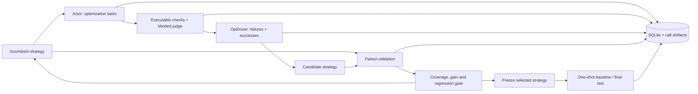

# Continual Harness

`continual_harness/config.py` owns immutable role/inference settings. `provider.py` implements the async provider boundary: nonstreaming JSON-object completions, pinned provider, disabled fallbacks, supported-parameter routing and bounded network timeout. It uses `asyncio.to_thread` around standard-library HTTP; concurrency is limited by a semaphore. Cancelling the Python coroutine does not guarantee cancellation of an already running HTTP request. There are no automatic retries.

`prompts.py` controls information boundaries. The actor sees only the existing public renderer output. The judge sees the fixed rules, public input, answer and rubric, without strategy/version or optimization history. The optimizer receives a deterministic family-diverse sample of valid optimization failures and successes, with reference answers and evaluation feedback. It never receives validation or test cases. API failures and invalid judgments are not optimization lessons. Strategy changes cannot edit benchmark files; every evaluation checks the frozen manifest.

`engine.py` orchestrates execution, evaluation, proposal, paired validation, selection and freezing. `metrics.py` keeps intended cohorts, actor completions, valid judgments and full-case successes distinct. Reported success rates use all intended cases as denominator, including infrastructure failures; they should be interpreted alongside coverage. A known objective failure may have `complete_success: false` despite an invalid judge, but its status blocks promotion. Missing evidence never becomes a pass.

The promotion rule requires full coverage in both arms, a strict gain above `min_gain` (fraction, not percent), and no more than `max_regressions` task/repetition regressions. A gain with zero allowed regressions is the default. Repetitions and paired outcomes are retained; this rule does not establish statistical significance. Repeated validation selection can still overfit the selection set. Only the final held-out comparison measures transfer.

`store.py` records content-addressed prompt versions and lineage, evaluations, proposals, comparisons, metadata and exact call artifacts. Artifacts retain raw replies, timestamps, requests, model/provider settings and generation usage. Authorization headers are never stored. The database and JSON files contain private benchmark evidence; the directory is not an actor-facing data source. Usage reports input/output tokens and recorded USD cost separately per role, with coverage counts. Absent provider usage stays absent; no fabricated or estimated totals. The synthetic demo records no usage/cost.

`test` checks the unchanged dataset and frozen experiment, then atomically reserves held-out access before any model call. It reports baseline versus frozen final and never promotes a strategy. Interrupted tests remain reserved: inspect their saved partial artifacts rather than retrying for a better test outcome. New experiments do not magically restore scientific independence once a human has inspected the held-out set. There is currently no resume/retry command or cross-experiment access-control service.

## Evidence limits

The demo deliberately obtains answers from private reference files and returns scripted judgments. It validates orchestration only. The harness proposes decisions/documents; it does not execute insurance transactions or provide a simulated account tool environment. Live model quality, provider eligibility and substantive judge correctness need live runs and manual calibration. Actor/judge/optimizer model selection is explicit in configuration; no paid calls run during setup or offline tests.

The OpenRouter request follows the official [chat completion API](https://openrouter.ai/docs/api/api-reference/chat/send-chat-completion-request) and [provider routing](https://openrouter.ai/docs/guides/routing/provider-selection). JSON output is still validated locally. No model or price recommendations are baked in.
